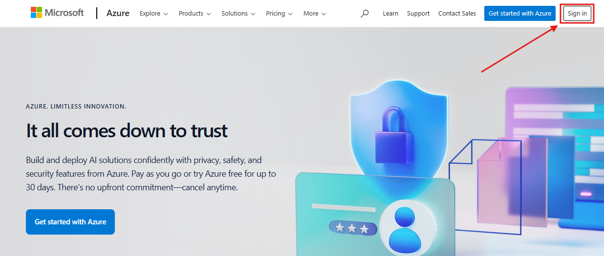
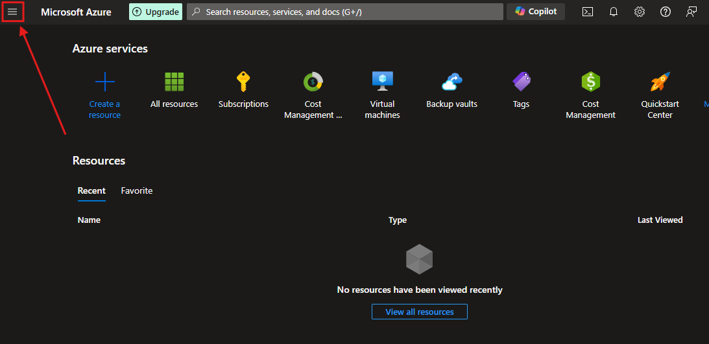
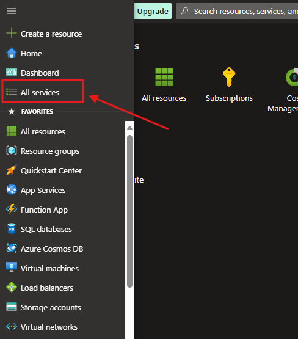
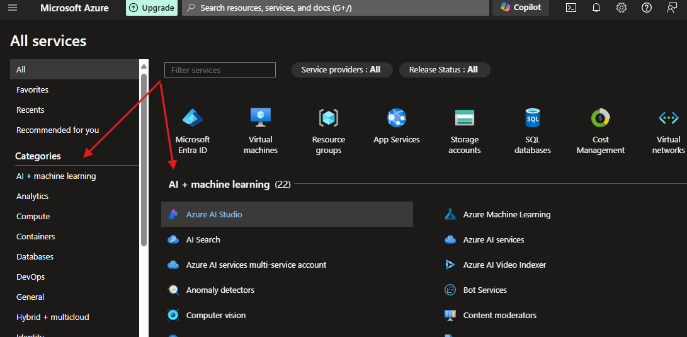

## Localizar serviços por categoria
---
1. Em primeiro lugar, aceda ao site da [Microsoft Azure](https://azure.microsoft.com).
  
2. Para localizar os serviços por categoria, caso o menu lateral não apareça, clique no ícone de menu _hamburger_.   
   
  
3. Clique em **All Services**

  
4. E voilà... Todos os serviços e categorias serão listados.

  