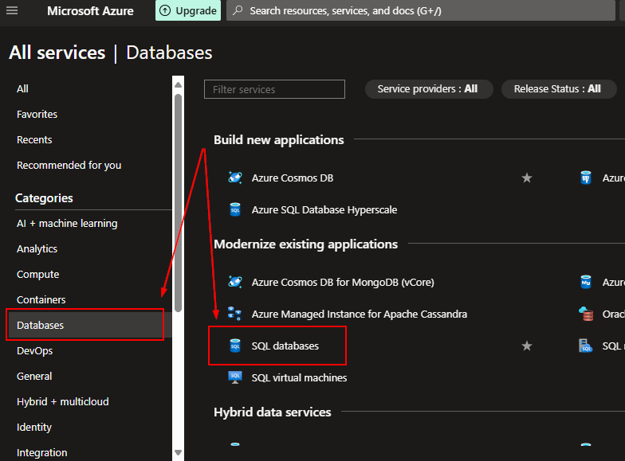
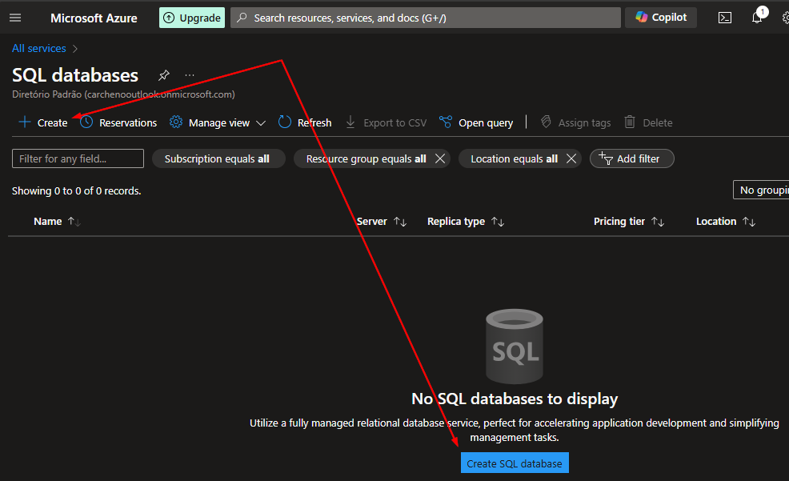
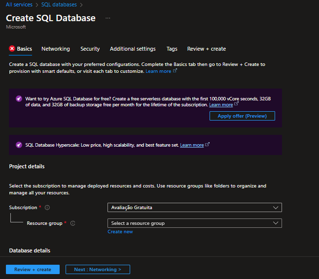

## Configurando uma instância de Banco de Dados SQL:

#### PaaS (Plataforma como Serviço)

É um ambiente de desenvolvimento e hospedagem de aplicativos, fornecendo ferramentas e serviços para criar, testar e implantar software.

**Exemplo:** Utilizar uma plataforma para desenvolver um aplicativo web, sem precisar se preocupar com a infraestrutura subjacente.

Para configurar uma instância de Banco de Dados SQL:

1. Acesse _Categories_ -> _Databases_ -> _SQL databases_.

  
2. Clique em _Create_.

  
3. Configure as opções de banco de dados de acordo com as especificações do projeto. Como não teremos acesso direto ao servidor, todas as configurações serão feitas na instância do banco de dados.

  

#### Links

[Banco de Dados SQL](https://learn.microsoft.com/pt-br/azure/azure-sql/database/sql-database-paas-overview?view=azuresql)
