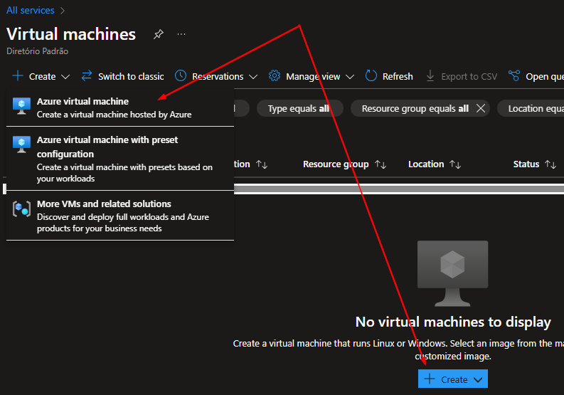

## Criar máquinas Virtuais:

Para criar uma máquina virtual:

1. Acesse _Categories_ -> _Compute_ -> _Virtual Machines_.

  
2. Clique em _Create_.

  
3. Configure as opções de acordo com as necessidades do projeto. Por exemplo, para garantir alta disponibilidade, escolha a opção _Availability Options_. Embora isso possa aumentar o custo, o SLA será melhor, reduzindo o tempo de indisponibilidade da máquina.

  

#### Links

[Opções de disponibilidade para Máquinas Virtuais](https://learn.microsoft.com/pt-br/azure/virtual-machines/availability)
